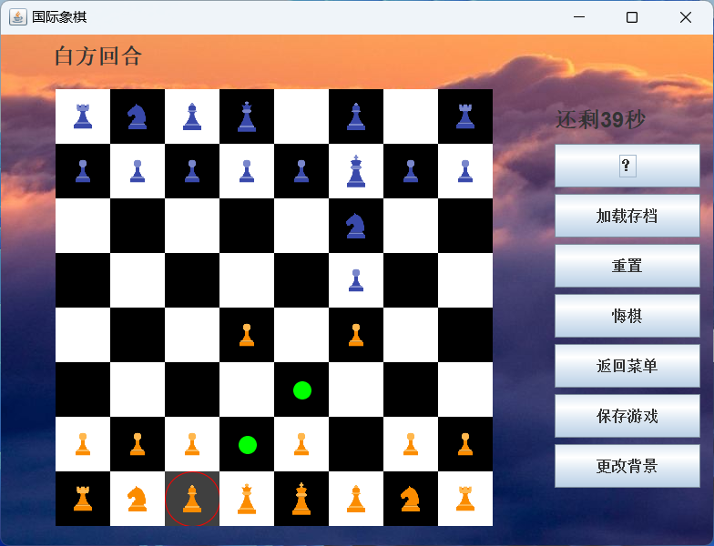
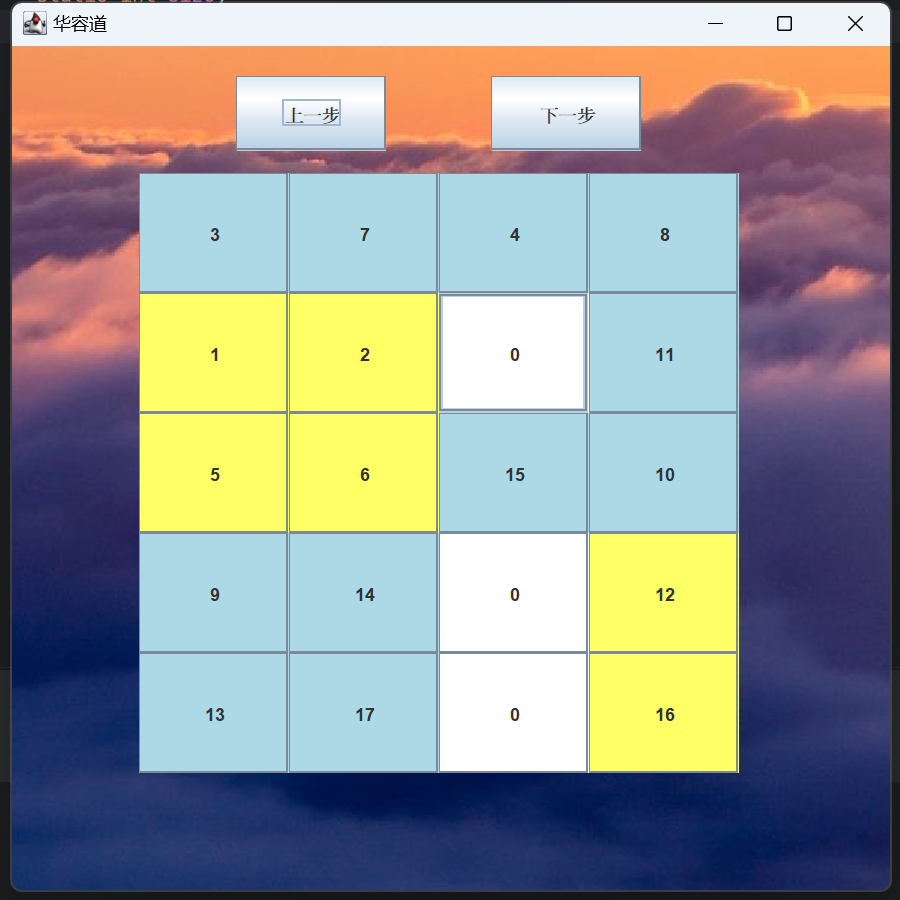
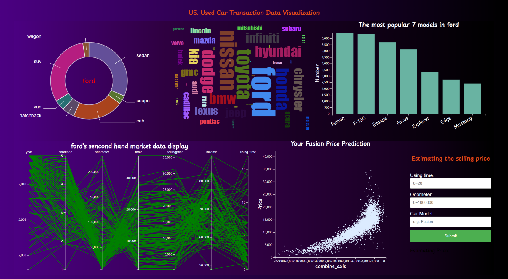

## 01 A chess game system developed in Java

Collaborator: Jingying Gu

CS102 A: Introduction to Computer Programming

In this project, a chess game system is developed using Java (the interface is in Chinese). All rules of chess are implemented in this system. The interface is created using `javax.swing`. Click `hello.exe` to start the game! Some supplementary functions include:

- Hint for the next move, displayed as green dots.
- Countdown: each player has 45 seconds to make a decision; otherwise, the turn automatically switches to the opponent.
- Music and various background settings.
- Game saving: this feature generates a text file containing the basic information of the chessboard, including whose turn it is.
- Undo a move: multiple undos are allowed.

Drawbacks:

This system is not online, so players can only play on a single computer. Additionally, the interface could be improved to look nicer.

## 02 An algorithm used for searching answer for Number Puzzle game (华容道) 

Collaborator: Junjie Qiu

CS203B: Data Structures and Algorithm Analysis

This project aims to develop a solver for a number puzzle game. Given any initial configuration, the goal is to determine if there is a solution. In this puzzle, `0` represents an empty space, yellow blocks represent large blocks (which can be 2x1, 1x2, or 2x2), and blue blocks represent small blocks (which are 1x1). For example, the final solution should look like [[1, 2, 3, 4], [5, 6, 7, 8], [9, 10, 11, 12], [13, 14, 15, 16], [17, 18, 0, 0]], In the searching process, only the blocks adjacent to the `0` block can be moved.

We implemented three solvers: `Solver`, `Solver1`, and `Solver2`. The `Solver` uses a self-designed greedy algorithm, `Solver1` uses pure BFS (Breadth-First Search), and `Solver2` uses pure DFS (Depth-First Search). The greedy algorithm in `Solver` prioritizes the move of blocks based on the distance between their current dashboard structure and the target dashboard structure, giving higher priority to the move of blocks and structures that will lead the board closer to its final structure. A Min Priority Queue (MinPQ) is used to manage the board's search structure. When the size of MinPQ exceeds 500,000, we retain only the best 10,000 points. This implementation performs significantly better than `Solver1` and `Solver2`, allowing `Solver` to handle boards as large as 6x6 in a limited amount of time, while the other two can only handle up to 3x3 boards. For detailed information on the algorithms, please refer to [...] (Written in Chinese)

Once the search process is complete, a final dashboard will be generated, displaying the steps taken to arrive at the solution.

## 03 A data analysis of Bilibili’s user study

Collaborator: Ruiwei Liang, Leping Li

STA217: Introduction to Data Science

Bilibili (commonly known as B站) has gradually matured over the past few years in China (like Youtube), becoming a highly concentrated cultural community and video platform for the younger generation in China. As the number of Bilibili users and vloggers has increased, Bilibili has come to reflect the value orientations of China's younger generation to some extent. Consequently, the importance of big data research on Bilibili has become increasingly evident.

By analyzing the behavior of Bilibili's vloggers, we can gain a clearer understanding of the psychological needs and interests of today's youth, as well as the relationship between certain behaviors of vloggers and their number of fans. This allows us to better grasp the current mainstream values and provide relevant suggestions for both new and experienced vloggers on creating videos and attracting fans.

Dataset: 

- A csv file containing basic information of  5k vloggers in 2019, from Prof. Yifang Ma
- A tracking data based on the id of the vloggers (2022), collected by Google Web Scraper. 

## 04 A face detection system based on DeepFace

Collaborator: Qiang Hu, Bin Huang 

CS308: Computer Vision

> a tab

